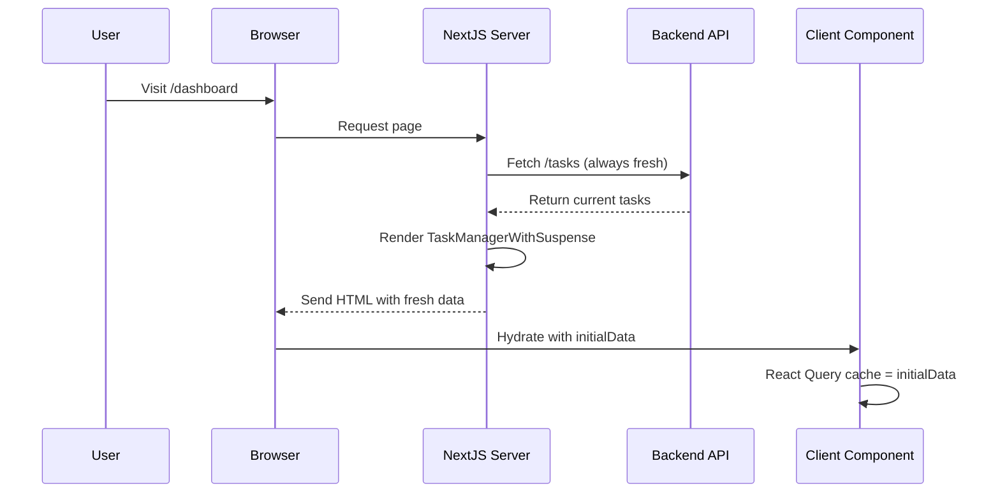
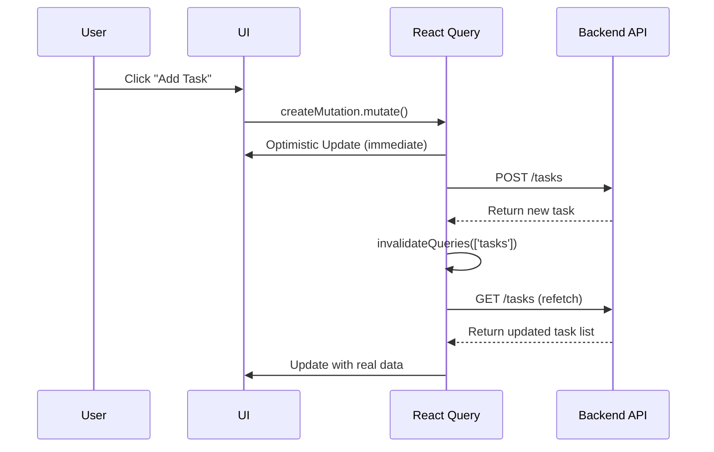

# Task Manager Implementation - Simplified Client-Only Architecture

## Overview

This document describes the simplified task manager implementation that uses **client-only caching** with TanStack Query v5, optimized for deliberate user interactions.

## Simplified Architecture Decision

**We removed server-side caching** after analyzing that:

- Task management is inherently **write-heavy** (users create, edit, delete frequently)
- Server cache was being invalidated on most user interactions (~20% hit rate)
- The complexity of dual-cache synchronization wasn't justified for small task datasets
- **Suspense + always-fresh data** provides better consistency

## Data Flow & Caching Behavior

### Initial Page Visit Flow



**Benefits of simplified flow**:

- ✅ **Always consistent**: Page refresh always shows latest data
- ✅ **No cache sync issues**: Single source of truth
- ✅ **Faster debugging**: Only one cache layer to reason about

### User Interaction Flow (e.g., Creating a Task)



**Simplified mutation flow**:

1. **Optimistic Update**: UI immediately shows new task (smooth UX)
2. **API Call**: Send request to backend
3. **Client Refetch**: Get fresh data to ensure consistency
4. **UI Update**: Real data replaces optimistic update

### TanStack Query Configuration (Optimized for Deliberate Interactions)

```tsx
const { data: tasks } = useQuery({
  queryKey: ['tasks'],
  queryFn: taskApi.list,
  initialData: initialTasks, // From server
  staleTime: 5 * 60 * 1000, // 5 minutes - data stays fresh longer
  gcTime: 10 * 60 * 1000, // 10 minutes - keep in cache longer
  refetchOnWindowFocus: false, // No auto-refetch on window focus
  refetchOnReconnect: false, // No auto-refetch on network reconnect
  refetchInterval: false, // No background polling
});
```

**Why we disabled automatic syncing**:

- **Deliberate interactions**: Users only want data to update when they take action
- **Bandwidth efficiency**: No unnecessary background requests
- **Predictable behavior**: Data only changes when user expects it
- **Privacy**: No automatic background API calls

## Simplified File Structure

```
frontend/src/
├── app/dashboard/page.tsx                 # Clean dashboard page
├── components/dashboard/
│   ├── TaskManagerWithSuspense.tsx       # Server component for fresh data fetching
│   ├── TaskManagerClient.tsx             # Client component with optimized React Query
│   └── ...other components
├── lib/task-api.ts                        # Client-side API functions
├── server/
│   └── task-actions.ts                    # Simple server actions (no caching)
└── ...
```

**Removed files**:

- ❌ `cache-actions.ts` - No longer needed
- ❌ All caching logic from `task-actions.ts`

## Key Improvements

### 1. Eliminated Cache Complexity

- **Before**: Dual-cache system with synchronization issues
- **After**: Single client cache with always-fresh initial data
- **Benefits**: No cache invalidation bugs, simpler debugging

### 2. Optimized for Write-Heavy Usage

- **Before**: Cache frequently invalidated by mutations
- **After**: Accept slightly slower initial loads for guaranteed consistency
- **Benefits**: Perfect for task management workflows

### 3. Disabled Unnecessary Auto-Sync

- **Before**: Background refetching, window focus refetching, reconnect refetching
- **After**: Data only updates on deliberate user actions
- **Benefits**: Predictable behavior, bandwidth efficiency

### 4. Suspense + Always Fresh Data

- **Before**: Complex caching with potential stale data
- **After**: Suspense boundary + guaranteed fresh initial load
- **Benefits**: Better UX, no stale data surprises

## Benefits of New Implementation

### Performance

- **Consistent Initial Load**: Always shows current data (no stale cache surprises)
- **Smooth Interactions**: Optimistic updates for immediate UI feedback
- **Efficient Client Cache**: Longer stale times since no auto-background sync

### Developer Experience

- **Simpler Architecture**: Only one cache layer to understand
- **Better Debugging**: Clear data flow, no dual-cache synchronization issues
- **Predictable Behavior**: Data only changes when user takes action

### User Experience

- **Always Current**: Page refresh guarantees latest data
- **Instant Feedback**: Optimistic updates for immediate response
- **No Surprises**: Data doesn't change unexpectedly in background

## Usage Example

```tsx
// Server Component (always fetches fresh data)
async function TaskManagerWithSuspense() {
  const tasks = await fetchTasks(); // Always fresh, no caching
  return <TaskManagerClient initialTasks={tasks} />;
}

// Client Component (optimized React Query)
function TaskManagerClient({ initialTasks }) {
  const createMutation = useMutation({
    mutationFn: taskApi.create, // Just the API call
    onMutate: async (newTask) => {
      // Optimistic update (client cache only)
      await queryClient.cancelQueries({ queryKey: ['tasks'] });
      const previous = queryClient.getQueryData(['tasks']);
      queryClient.setQueryData(['tasks'], (old) => [tempTask, ...old]);
      return { previous };
    },
    onError: (err, newTask, context) => {
      // Rollback on error
      queryClient.setQueryData(['tasks'], context.previous);
    },
    onSettled: () => {
      // Refetch to ensure consistency
      queryClient.invalidateQueries({ queryKey: ['tasks'] });
    },
  });
}
```

## When to Use This Architecture

### ✅ Perfect For:

- **Write-heavy applications** (task management, content creation)
- **Small to medium datasets** (hundreds of tasks, not thousands)
- **Deliberate user interactions** (users expect data to change when they act)
- **Consistency-critical apps** (always showing current state is important)

### ❌ Consider Server Cache For:

- **Read-heavy applications** (browsing, viewing content)
- **Large datasets** (thousands of records where initial load time matters)
- **High-traffic apps** (where backend load reduction is critical)
- **Real-time collaboration** (where background sync provides value)

## Performance Characteristics

| Metric                   | Server Cache     | Client-Only     | Winner          |
| ------------------------ | ---------------- | --------------- | --------------- |
| **Initial Load (Fresh)** | ~200ms           | ~300ms          | 🟡 Server Cache |
| **Initial Load (Stale)** | ~50ms            | ~300ms          | 🟢 Server Cache |
| **User Interactions**    | ~100ms           | ~100ms          | 🟡 Tie          |
| **Data Consistency**     | ❌ Risk of stale | ✅ Always fresh | 🟢 Client-Only  |
| **Code Complexity**      | 🔴 High          | 🟢 Low          | 🟢 Client-Only  |
| **Debug Difficulty**     | 🔴 Hard          | 🟢 Easy         | 🟢 Client-Only  |

**Verdict**: For task management use cases, **client-only wins** due to consistency and simplicity benefits outweighing the minor initial load performance cost.

## Migration Benefits

1. **Eliminated Cache Bugs**: No more dual-cache synchronization issues
2. **Simplified Debugging**: Single cache layer, clear data flow
3. **Better Consistency**: Page refresh always shows latest data
4. **Reduced Complexity**: ~50% less caching code to maintain
5. **Optimized UX**: No unexpected background data changes
6. **Bandwidth Efficient**: No unnecessary auto-sync requests
